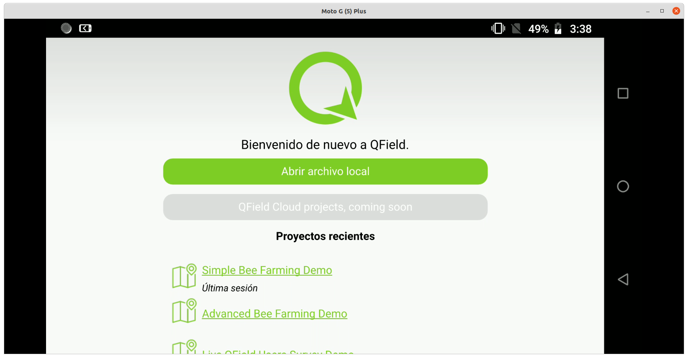
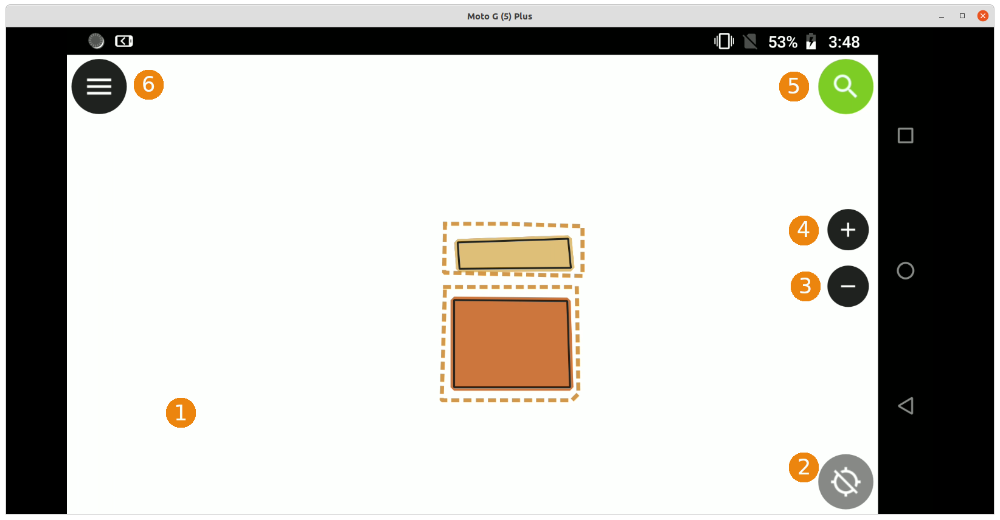
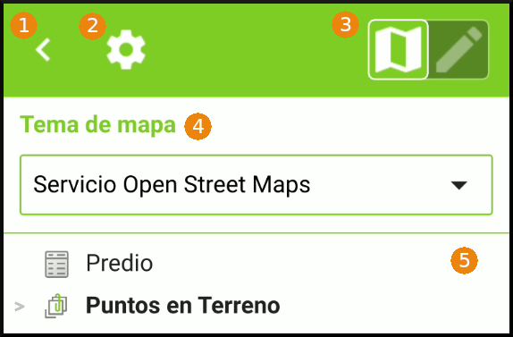

# Interfaz
## Abrir el proyecto

La interfaz inicial de QField contiene dos elementos principales: *Abrir archivo local* y el listado de *Proyectos Recientes*.

### Abrir archivo local

Mediante este botón es posible acceder a los directorios de almacenamiento del dispositivo móvil, de manera que sea posible seleccionar el proyecto de QGIS a trabajar o el conjunto de datos que se quiere desplegar en QField.

Considerando lo anterior, sólo basta con navegar por la ruta de directorios que el usuario haya definido, y seleccionar el archivo que se desea abrir por medio de la aplicación.

### Proyectos Recientes

Consiste en un acceso rápido de los últimos proyectos de QGIS (.qgs ó .qgz)  o conjunto de datos (*dataset*) que el usuario haya desplegado por medio de la aplicación recientemente.
## Área de trabajo 

El área de trabajo de la aplicación QField se compone básicamente de seis (6) elementos: 

### 1. Lienzo

Hace referencia al espacio donde es posible visualizar e interactuar por medio de las herramientas de navegación con la información cargada por el usuario (mapas base, capas geográficas, imágenes, entre otros).

### 2. Botón de ubicación o posicionamiento 

Corresponde a un botón que se encuentra en la esquina inferior derecha del lienzo, mediante el cual es posible habilitar o deshabilitar el acceso a la <u>Localización/Ubicación</u> del dispositivo móvil a la aplicación.

Al presionar este botón por al menos tres (3) segundos se despliega un menú que contiene: 

- Tipo de dispositivo (interno o externo) del cual la aplicación obtiene la información de localización.

- Casilla de verificación para habilitar o deshabilitar la opción de posicionamiento.

- Casilla de verificación para "Mostrar información de la posición". Si esta opción está activada, en la parte inferior del lienzo se despliega una ventana con:

  - Coordenada X
  - Coordenada Y
  - Información de Altitud
  - Velocidad
  - Precisión Horizontal
  - Precisión Vertical

  

  
IMPORTANTE

  
Estos datos están en función de la precisión del dispositivo del cual se extrae la información de posicionamiento.

  

  - Opción para acceder a la "Configuración de posicionamiento". Como su nombre lo dice, permite acceder a la configuración de QField en lo correspondiente con los ajustes de localización ver pestaña configuración .
  - Opción para "Centrar en la posición actual", como herramienta de navegación permite que el lienzo se centre en la ubicación que provee el dispositivo.

### 3. Zoom out 

Herramienta de navegación que permite que el usuario modifique la escala de visualización del lienzo reduciendo el detalle de información cargada en el proyecto.

### 4. Zoom in 

Herramienta de navegación con la cual es posible que el usuario modifique la escala de visualización del lienzo ampliando el detalle de información que se despliega en la aplicación.  

### 5. Barra de búsqueda 

Con esta herramienta es posible realizar la búsqueda de registros y atributos sobre la información cargada por el usuario. Para hacer uso de esta función, se requiere previa definición de los campos y capas geográficas sobre las cuales se habilitará esta acción.

### 6. Menú 

Botón ubicado en la esquina superior izquierda del área de trabajo de la aplicación, mediante el cual se despliega una ventana con las siguientes opciones:

1. Botón incluir icono   (Regresar)

   Se trata de la opción para cerrar la ventana que se despliega al hacer click en el botón de menú. 

2. Botón (Configuración)

   Al hacer click en este botón, se despliega un menú con las opciones:

   - Herramientas de medida
   - Imprimir a PDF
   - Abrir proyecto
   - Configuración
   - Message Log
   - Acerca de QField

3. Botón (Modos de trabajo)

   Corresponde al botón con el que el usuario selecciona el modo de trabajo a emplear, estos son: Modo digitalización  y Modo exploración . 

4. Tema de mapa

   Desplegable que permite elegir entre los mapas base que el usuario haya definido previamente.

5. Contenido del proyecto

   Permite visualizar en un listado la información cargada por el usuario al proyecto:

   - Elementos individuales
     - Tablas
     - Capas geográficas
     - Imágenes ráster
   - Grupos

## Configuración

## Modo visualización

## Modo edición

## Opciones de capas geográficas