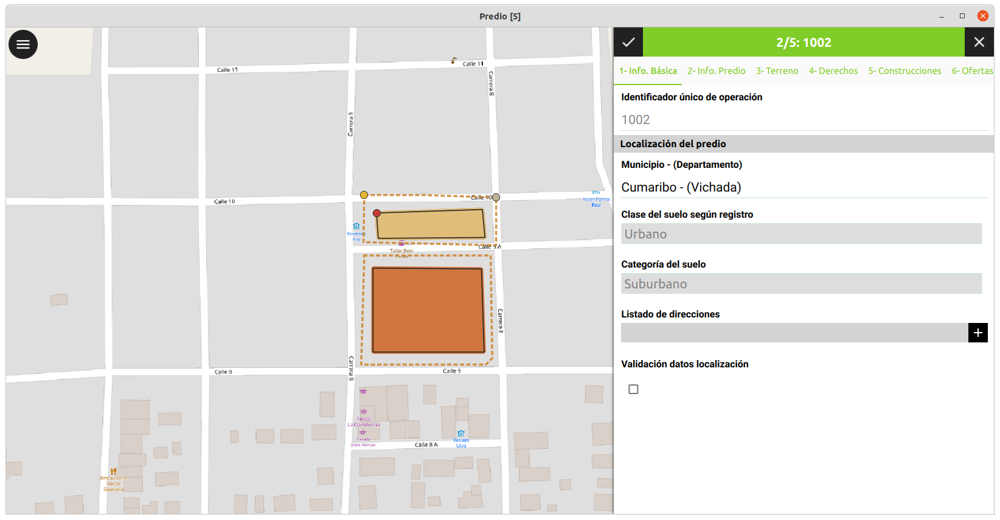
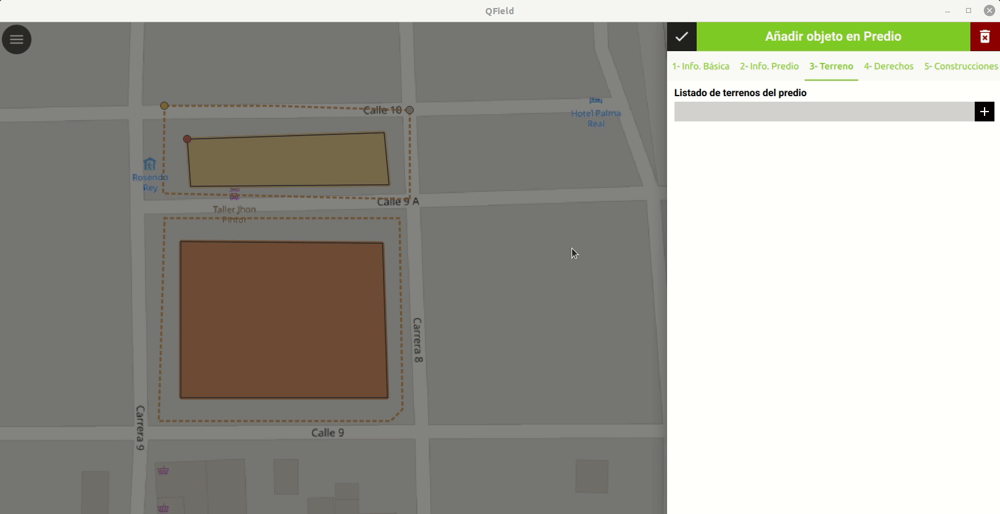
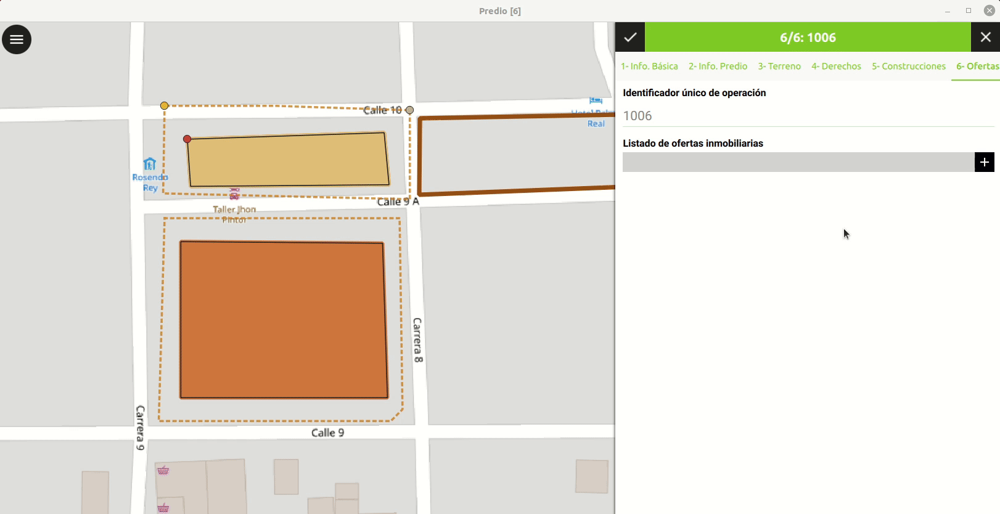
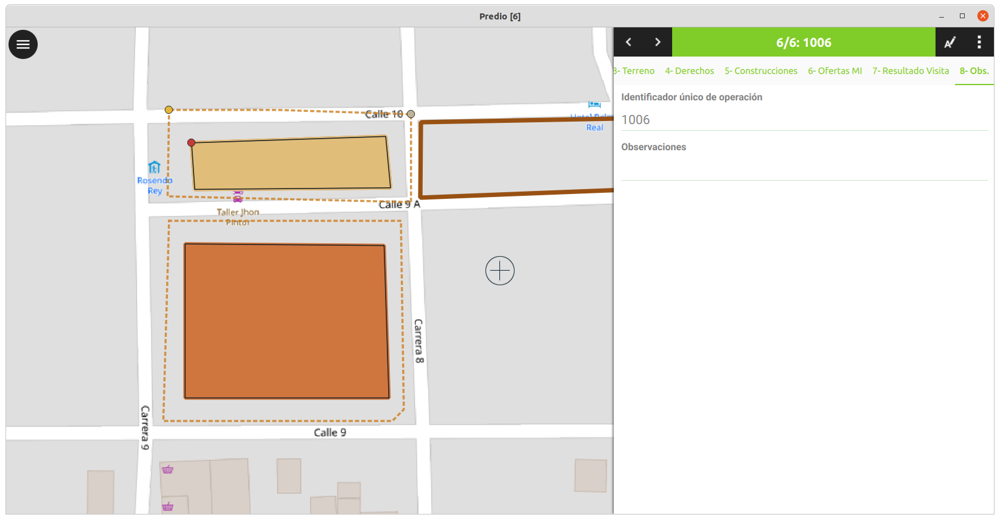

# Recolección de datos

<!-- ## Flujo de captura para predios nuevos (Formación)

## Flujo de captura para predios existentes (Actualización) -->

## Formulario de puntos 

Los formularios de puntos se encuentran divididos en tres (3) clases, estas son: Lindero, Control y Levantamiento. Al interior de los formularios encontraremos que los siguientes atributos se encuentras en las tres (3) clases de puntos: 

- Posición interpolación 
- Punto tipo 
- Método de producción 

Además es importante resaltar, que cada una de estas clases facilita el levantamiento en campo de un tipo de información específica, el punto lindero es utilizado, como su nombre lo indica, para el levantamiento de la información de los linderos asociados al predio que se va a registrar, por otro lado los puntos de control, facilitan el levantamiento de puntos materializados o con un nivel de precisión de mayor calidad en el momento de captura de los linderos asociados al predio, por último se encuentran los puntos de levantamiento que facilitan la recolección de las unidades de construcción en el momento de captura. 

### Lindero 

Representación de la captura en campo de un punto lindero

### Control 

Representación de la captura en campo de un punto control

### Levantamiento

Representación de la captura en campo de un punto levantamiento

## Formulario de predio

El formulario de predio cuenta con una configuración basada en secciones para facilitar la captura de los diferentes componentes tanto alfanuméricos como geográficos. 

Este formulario se encuentra dividido en 8 secciones que se describirán a continuación.

### 1 - Información básica

Esta sección facilita la identificación de variables y características generales del predio como su localización e información del suelo, además es posible desde esta sección generar información geográfica asociada al predio, como lo son las direcciones del predio. 

### 2 - Información del predio

La sección de información del predio es una de las más largas del formulario y contempla el diligenciamiento de información alfanumérica relacionada a datos catastrales, datos registrales y la condición del predio. Dependiendo de cómo se diligencie este formulario, se habilitarán diferentes opciones relacionadas a los campos definidos anteriormente.

### 3 - Terreno

La tercera sección corresponde al formulario de terreno, esta tiene un componente geográfico, en donde se adquiere la geometría del terreno asociado al predio y se almacena la información asociada a ese terreno.

### 4 - Derechos

La cuarta sección corresponde a los derechos, en esta es posible adicionar uno o varios interesados o restricciones asociados al predio.

#### Interesados

Dentro del formulario de interesado, es posible agregar un nuevo interesado con su respectivo formulario o seleccionar uno ya existente dentro de la base de datos, también se agrega información asociada al derecho y una o varias fuentes.

##### Fuentes

Las fuentes permiten adicionar un adjunto a partir de la toma de una fotografía y el diligenciamiento de los diferentes atributos al interior del formulario. 
#### Restricciones del predio

El formulario de restricciones es bastante sencillo, ya que en este se agrega el tipo de servidumbre asociada al predio. 

### 5 - Construcciones

Esta sección facilita la creación de una o varias construcciones, el formulario está compuesto por dos pestañas, la primera que es información alfanumérica asociada a la construcción y la segunda permite la creación de una o varias unidades de construcción geográficas.
#### Unidades de construcción

El formulario de las unidades de construcción varía según las características que se seleccionen a lo largo del formulario, en este es posible agregar diferentes tipos de calificaciones de construcción, no convencionales y convencionales, siendo estas últimas las que tienen un formulario aparte para asociarlo a cada unidad de construcción.

### 6 - Ofertas de mercado inmobiliario

La sección de ofertas de mercado inmobiliario facilita agregar una o varias ofertas inmobiliarias asociadas al mismo predio, dentro de este formulario se solicitan la información del tipo de oferta, el valor pedido, el valor negociado, la fecha de captura de la oferta, el tiempo de la oferta en meses, el nombre del oferente y el teléfono de contacto del oferente, variables obligatorias para la captura de este formulario.

### 7 - Resultado de la visita 

En la sección de resultado visita, como su nombre lo indica, se recopila la información relacionada a la persona que atendió la visita y su relación con el predio.

### 8 - Observaciones

Esta es la última sección de la documentación y tiene por objetivo permitirle al reconocedor agregar las observaciones o novedades obtenidas en campo.

## Edición de capas geográficas

La edición de capas geográficas se realiza mediante la selección del objeto geográfico en la interfaz o la búsqueda de este a partir de la barra de búsqueda, una vez que seleccionamos el objeto se nos activan dos opciones, una que corresponde a la edición del formulario en la parte alfanumérica y otra que corresponde a la edición de la parte geográfica  

### Edición geográfica 

Esta opción nos habilita el modo de edición de la geometría, destacando los vértices de esta y habilitando las siguientes opciones: 

* Herramienta de vértices: Mediante esta opción se puede(n) editar (desplazar, eliminar y/o adicionar) el (los) vértice(s) de la capa vectorial seleccionada.
* Herramienta de división: Esta herramienta permite fraccionar la capa vectorial seleccionada (geometría de tipo línea o polígono) en el número de partes deseado de acuerdo del trazado que el usuario defina en el espacio de trabajo.
* Herramienta de remodelado: Corresponde a la herramienta que permite extender o reducir (en consideración del trazado que defina el usuario) parte de la capa vectorial tipo polígono seleccionada.
* Herramienta de relleno de anillo: Como su nombre lo indica, haciendo uso de esta herramienta se rellena(n) el(los) espacios que se evidencian como anillos en la capa vectorial seleccionada de geometría tipo polígono.

### Edición alfanumérica 

En este tipo de edición se accede a los atributos del formulario y es posible modificarlo, siempre y cuando en la configuración del proyecto, se habilite la opción de edición de cada una de las variables.